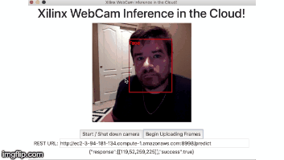

# Webcam-Client
This repo provides software for users to deploy an application that captures frames from a webcam, and upload's them to a user specified server via HTTP form post request. By using Electron, node, and javascript ... this software can run on any hardware platform.  

## End Goal
<p align="center">
    
</p>

## To Use

To clone and run this repository you'll need [Git](https://git-scm.com) and [Node.js](https://nodejs.org/en/download/) (which comes with [npm](http://npmjs.com)) installed on your computer. Use the necessary installers for your system, and install both utilites.  
  
If you have trouble running npm commands inside of git bash after installation, try closing it, and opening it again.  
  
For windows users I highly recommend using git bash.  
  
Then, From your command line:

```bash
# Clone this repository
git clone https://github.com/wilderfield/webcam-client
# Go into the repository
cd webcam-client
# Install dependencies
npm install
# Run the app
npm start
```
  
Once the app starts, paste the predict URL of your server into the REST URL field.  
For this AWS demo, it will always be: `http://<publicDNS>:8998/predict`  
i.e. `http://ec2-3-94-181-134.compute-1.amazonaws.com:8998/predict`  
  
Then click, enable camera, then click Start Uploading Frames.  

## Additional Background About Electron

- [electronjs.org/docs](https://electronjs.org/docs) - all of Electron's documentation
- [electronjs.org/community#boilerplates](https://electronjs.org/community#boilerplates) - sample starter apps created by the community
- [electron/electron-quick-start](https://github.com/electron/electron-quick-start) - a very basic starter Electron app
- [electron/simple-samples](https://github.com/electron/simple-samples) - small applications with ideas for taking them further
- [electron/electron-api-demos](https://github.com/electron/electron-api-demos) - an Electron app that teaches you how to use Electron
- [hokein/electron-sample-apps](https://github.com/hokein/electron-sample-apps) - small demo apps for the various Electron APIs

## License

[MIT](LICENSE)
